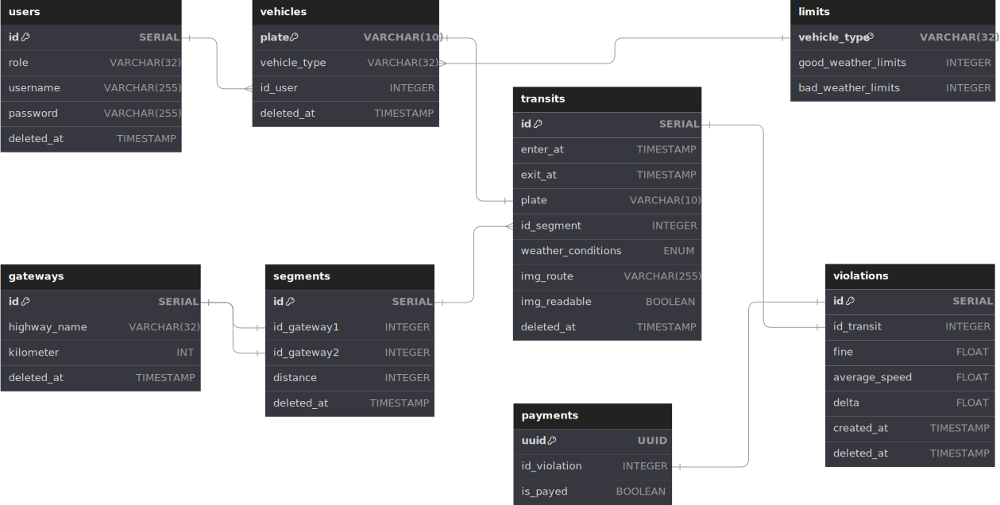

# RadarFineCalculator
<p align="center">
   
 </p>

<div align="center">
 
[](https://www.postgresql.org/)
[](https://www.npmjs.com/)
[](https://nodejs.org/en)
[](https://expressjs.com/it/)
[](https://jwt.io/)
[](https://code.visualstudio.com/)
[](https://www.typescriptlang.org/)
[](https://sequelize.org/)
[](https://www.docker.com/)
[](https://www.postman.com/)
[](https://www.npmjs.com/package/node-tesseract-ocr?activeTab=readme)
 
</div>

# Progetto-Programmazione_Avanzata-2024: Creazione backend per la gestione e il calcolo di multe ottenute in autostrada
<p align="center">
   
   
 </p>

## Tabella dei Contenuti
- [Introduzione e Specifiche Progetto](#introduzione-e-specifiche-progetto)
- [Installazione](#installazione)
- [Configurazione](#configurazione)
- [Diagrammi UML](#database-e-diagrammi-uml)
- [Rotte](#rotte)
- [Design Pattern](#design-pattern)
- [Test Postman](#test-postman)
- [Altri Strumenti](#altri-strumenti)
- [Autori](#autori)
- [License](#license)

## Introduzione e Specifiche Progetto
Il progetto RadarFineCalculator, sviluppato per l'esame del corso di Programmazione Avanzata tenuto presso l'Università Politecnica delle Marche(UNIVPM), durante l'anno accademico 2023-2024, realizza un'API per la gestione dei dati. L'obiettivo del progetto consiste nel realizzare un sistema che consenta di gestire il calcolo di eventuali multe a seguito del passaggio di autoveicoli con classi differenti tra diversi varchi autostradali (es. sistema Tutor). Le specifiche prevedono che vengano:
- modellati le tipologie di veicolo che hanno limiti differenti.
- Modellati i varchi che hanno una posizione geografica nota.
- Inseriti i transiti impostando data e ora del passaggio e targa del veicolo lungo una tratta che ha un varco di inizio, un varco di fine ed una distanza.
- Riportate, nel caso di inserimento di transiti, le condizioni metereologiche del varco ovvero se era presente o meno pioggia in modo da ridurre il limite di velocità.
- Generate delle infrazioni per superamento della velocità media tra due varchi limitrofi.

Inoltre, va specificato che un veicolo in un giorno può attraversare diversi varchi / tratte. 

## Installazione

### Requisiti
Per eseguire correttamente l'installazione del progetto è necessario aver installato una delle versioni recenti di Docker, Docker-compose e Git, per poter riuscire a clonare il codice.

Per testare l'applicazione viene utilizzato il client API Postman ed è stata già preparata una collection, in cui viene testato il codice sia in caso di fallimento che di successo; che è possibile trovare [qui](RadarFine.postman_collection.json).

### Avvio Progetto

1. Clona la repository sulla tua macchina locale usando Git con il seguente comando:

```bash
git clone https://github.com/PaceElisa/RadarFineCalculator.git
cd RadarFineCalculator

```
2. Inserire il file .env desiderato all'interno della directory app. Il file .env contiene alcune variabili d'ambiente necessarie per il funzionamento del progetto. Di seguito viene mostrato un esempio di file .env di prova:

```plaintext
POSTGRES_USER=myuser
POSTGRES_PASSWORD=mypassword
POSTGRES_PORT=5432
POSTGRES_DB=my_db
POSTGRES_HOST=database

PORT=3000

UPLOAD_DIR=images

JWT_SECRET=my-secret
```

3. Avviare il docker-compose contenente il container dell'applicazione e il container Postgres, all'interno della directory app. Eseguire poi il seguente comando per buildare il codice, mettere automaticamente in esecuzione il server e crare il network tra i container.

```bash
cd app
docker-compose up --build
```

4. Aprire Postman e caricare la collection fornita [qui](RadarFine.postman_collection.json)


### Note

- Nel caso di problemi con il caricamento del file .env eseguire il seguente comando di avvio del docker compose:

```bash
docker-compose --env-file ./app/.env up --build
```
- Se fosse necessario eliminare tutte le modifiche apportate al database (creato con Postgres e inizializzato tramite un file di seeding), andrebbe buttato giù i container e riavviare l'applicativo con il comando mostrato sopra.

```bash
docker-compose down
```


## Configurazione

### Docker  Compose
### Postgres
### Tesseract OCR

## Database e Diagrammi UML

### Database Schema
Il database è progettato per memorizzare i dati dei veicoli e dei relativi proprietari, i transiti, le infrazioni e le informazioni relative ai varchi. Di seguito è riportato lo schema del database:
  
* **Utenti** (users): Contiene le informazioni necessarie al login dell'utente come username, password e ruolo.
* **Veicoli** (vehicles): Contiene le informazioni relative ai veicoli come la targa, la tipologia di veicolo e l'utente al quale appartiene.
* **Varchi** (gateways): Contiene i varchi autostradali identificati con il nome dell'autostrada e il chilometro in cui è situato il singolo varco.
* **Tratta** (segments): Memorizza le tratte autostradali in cui è attivo il sistema di controllo della velocità. Ogni tratta è identificata dai varchi di inizio e fine e dalla distanza tra i due (calcolata automaticamente).
* **Transiti** (transits): Registra i transiti di un veicolo attraverso una tratta. Il transito viene creato al momento in cui il veicolo attraversa il primo varco, registrando la data e l'ora di ingresso. Successivamente, quando il veicolo attraversa il varco di uscita, il transito viene aggiornato con la data e l'ora di uscita. In base alle condizioni meteorologiche inserite, viene verificato se il veicolo ha superato i limiti di velocità consentiti, al fine di determinare eventuali infrazioni. Nel caso di inserimento di un transito con un'immagine in input, viene valutata la leggibilità dell'immagine. Se l'immagine è considerata leggibile, vengono inseriti i relativi attributi nel sistema, inclusi il percorso dell'immagine e l'indicazione della sua leggibilità.
* **Limiti di velocità** (limits): Definisce i limiti di velocità in base al tipo di veicolo e alle condizioni meteo.
* **Multe** (violations): Registra le infrazioni dei limiti di velocità rilevate dal sistema. Contiene informazioni come la velocità media rilevata tra i due varchi, l'ammontare della multa, l'ID del transito a cui fa riferimento e la differenza rispetto al limite di velocità consentito. 
* **Pagamenti** (payments): Contiene le informazioni relative ai pagamenti delle multe come l'uuid univoco del pagamento, l'ID della multa a cui fa riferimento e un indicatore sullo stato di pagamento della multa.

### Diagramma Casi D'Uso
Il diagramma dei casi d'uso illustra le principali interazioni tra i vari attori del sistema e le operazioni che possono eseguire.

* **Operatore** (admin): Si occupa della gestione dei veicoli, dei varchi, dei segmenti e dei transiti. Può effettuare operazioni di filtraggio come recuperare la lista dei transiti con immagini illeggibili per interpretare la targa del veicolo oppure visualizzare multe per targa e periodo temporale.
* **Varco** (gateway): Può creare un transito impostando l'ID del segmento quello in cui si trova come varco d'ingresso. Inoltre, può aggiungere immagini del veicolo in transito, che verranno elaborate dal sistema tramite OCR (Tesseract) per estrarre automaticamente la targa, evitando l'inserimento manuale dei dati del veicolo.
* **Automobilista** (driver): Può consultare l'elenco delle multe registrate per i veicoli di sua proprietà in un determinato intervallo di tempo e scaricare un bollettino di pagamento in formato PDF fornendo l'ID della multa.

### Diagramma Sequenze
Il diagramma delle sequenze illustra il flusso di eventi che avviene quando viene fatta una richiesta ad una rotta.  
Sono riportati i diagrammi delle sequenze delle rotte implementate.
#### Diagramma di Sequenze per la rotta di Login

#### Diagramma di Sequenze per le rotte CRUD di creazione

#### Diagramma di Sequenze per le rotte CRUD di lettura, aggiornamento e rimozione

#### Diagramma di Sequenze per la rotta di inserimento transito con immagine in input

#### Diagramma di Sequenze per la rotta di filtraggio transiti per immagine con targa illeggibile

#### Diagramma di Sequenze per la rotta di filtraggio multe

#### Diagramma di Sequenze per la rotta di download bollettino di pagamento


## Rotte

### Login
Per poter accedere alle altre rotte dell'applicazione, è necessario autenticarsi utilizzando una delle seguenti rotte:
* ```/login```: Utilizzata per l'autenticazione degli utenti "operatore" (admin) e "automobilista" (driver). Nel corpo della richiesta dovranno essere forniti in formato JSON l'username e la password dell'utente.
* ```/loginGateway``` Utilizzata per l'autenticazione degli utenti di tipo "gateway". Nel corpo della richiesta dovranno essere forniti il nome dell'autostrada e il chilometro del varco a cui si vuole accedere.
Queste chiamate restituiscono un token JWT che deve essere inserito nell'header Authorization delle richieste successive. Questo token verrà verificato dal middleware authMiddleware per garantirne la validità e autorizzare l'accesso alle rotte protette.

### CRUD Users, Vehicles, Gateways, Segments
Le operazioni CRUD di creazione, lettura, aggiornamento e rimozione di record delle tabelle Users, Vehicles, Gateways e Segments possono essere effettuate solo dall'utente "operatore" (admin).
* ```/api/MODEL``` (dove ```MODEL``` sta per ```users```, ```vehicles```, ```gateways``` o ```segments```): Utilizzata per la creazione di un nuovo record nella tabella corrispondente. Nel corpo della richiesta devono essere forniti gli attributi obbligatori per la creazione del record specificato.
* ```/api/MODEL/:id``` (dove ```MODEL``` sta per ```users```, ```vehicles```, ```gateways``` o ```segments```): Utilizzata per leggere, aggiornare o rimuovere il record con l'ID specificato come parametro della richiesta. Se si tratta di un aggiornamento, nel corpo della richiesta devono essere forniti gli attributi da modificare.

### Rotte CRUD Transit
Le operazioni CRUD su Transit sono strutturate in modo diverso rispetto a quanto riportato in precedenza.
* ```/api/transits/transitId/:id```: Permette di leggere o modificare gli attributi di un transito specifico utilizzando l'ID del transito. Utilizzabile dall'utente "admin". 
* ```/api/transits/GatewayId/:id```: Recupera i transiti filtrati per tratta con il varco specificato. Utilizzabile dall'utente "admin".
* ```/api/transits/:id```: Permette di eliminare il transito con l'ID specificato. Utilizzabile dall'utente "admin".
* ```/api/transits/plate/:id```: Aggiorna il campo exit_at dell'ultimo transito per un veicolo, identificato dalla targa. Questa rotta è utilizzata per gestire il termine del transito e verificare eventuali violazioni. Utilizzabile dall'utente "admin".
* ```/api/transits/```: Crea un nuovo record di Transit. Questa rotta è utilizzata per registrare un transito con i dettagli forniti nel corpo della richiesta. Utilizzabile dall'utente "admin" e dal ruolo "gateway".
* ```/api/transitsimage```: Crea un nuovo record di Transit utilizzando un'immagine. Questa rotta permette di registrare il transito caricando un'immagine contenente la targa del veicolo e specificando le condizioni meteorologiche e la tratta di interesse. Utilizzabile solo dal ruolo "gateway".

### Rotte Filtro
Le seguenti rotte sono utilizzate per effettuare operazioni di filtraggio.
* ```/api/unreadableTransits```: Recupera i transiti per i quali le targhe non sono state interpretate correttamente da Tesseract. È possibile filtrare i risultati per ID del gateway, se specificato come parametro di query.
* ```/api/violationfilter```: Filtra le violazioni in base alla targa (o alle targhe) e al periodo temporale forniti tramite query. Gli automobilisti (driver) possono visualizzare solo le violazioni relative alle proprie targhe, mentre gli operatori (admin) possono visualizzare tutte le violazioni.

### Rotta Download bollettino di pagamento
La rotta ```/api/receipt/:id_violation``` permette il download del bollettino di pagamento in formato PDF per una violazione specifica, identificata dall'ID fornito. Gli automobilisti (driver) possono scaricare solo i bollettini relativi alle proprie violazioni, mentre gli amministratori (admin) possono accedere a tutti i bollettini.

## Design Pattern

### Middleware
### Factory
### Singleton
### DAO
### Model View Controller

## Test Postman
## Altri Strumenti

### Generics


## Autori
## License


