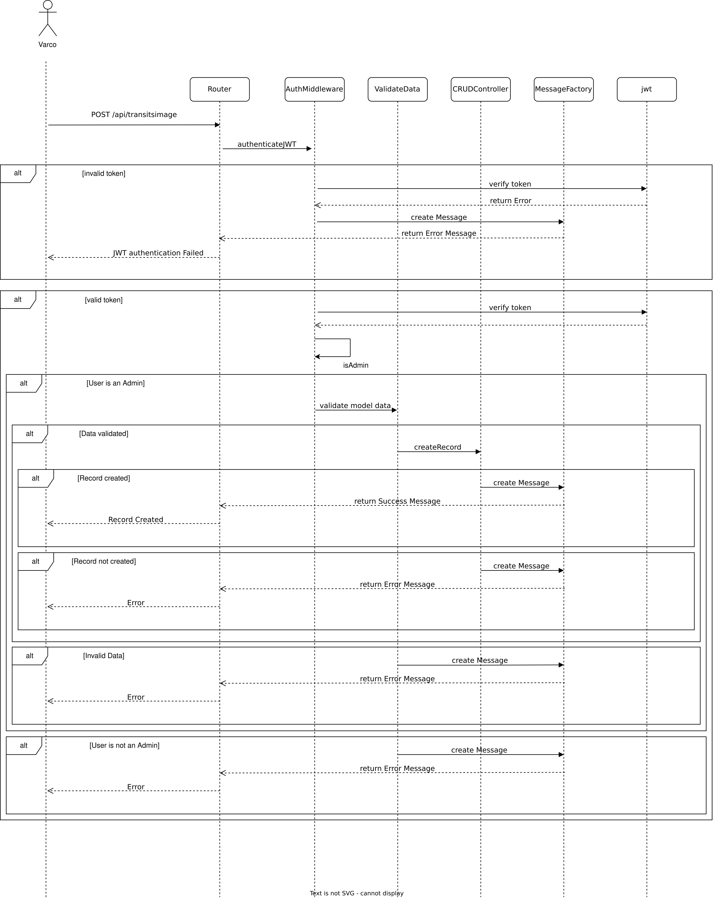
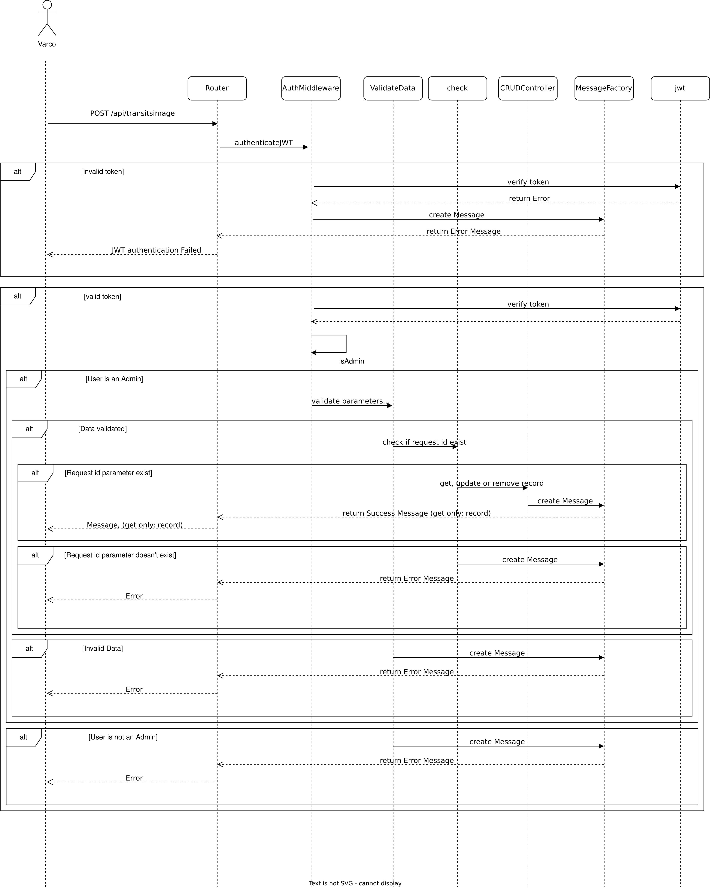
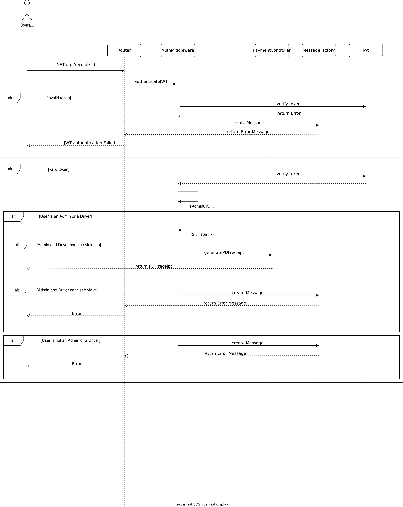
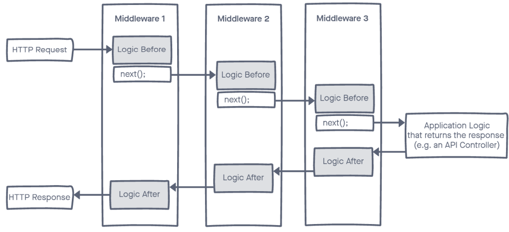
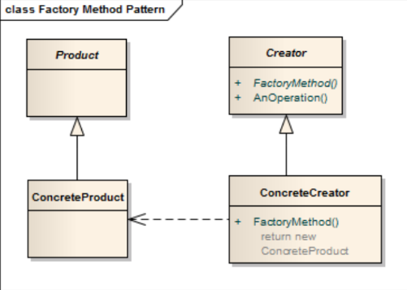
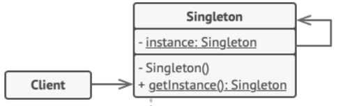

# RadarFineCalculator
<p align="center">
   
 </p>

<div align="center">
 
[](https://www.postgresql.org/)
[](https://www.npmjs.com/)
[](https://nodejs.org/en)
[](https://expressjs.com/it/)
[](https://jwt.io/)
[](https://code.visualstudio.com/)
[](https://www.typescriptlang.org/)
[](https://sequelize.org/)
[](https://www.docker.com/)
[](https://www.postman.com/)
[](https://www.npmjs.com/package/node-tesseract-ocr?activeTab=readme)
 
</div>

# Progetto-Programmazione_Avanzata-2024: Creazione backend per la gestione e il calcolo di multe ottenute in autostrada
<p align="center">
   
   
 </p>

## Tabella dei Contenuti
- [Introduzione e Specifiche Progetto](#introduzione-e-specifiche-progetto)
- [Installazione](#installazione)
- [Infrastrutture e Configurazione](#infrastrutture-e-configurazione)
- [Diagrammi UML](#database-e-diagrammi-uml)
- [Rotte](#rotte)
- [Design Pattern](#design-pattern)
- [Test Postman](#test-postman)
- [Autori](#autori)
- [License](#license)

## Introduzione e Specifiche Progetto
Il progetto RadarFineCalculator, sviluppato per l'esame del corso di Programmazione Avanzata tenuto presso l'Università Politecnica delle Marche(UNIVPM), durante l'anno accademico 2023-2024, realizza un'API per la gestione dei dati. L'obiettivo del progetto consiste nel realizzare un sistema che consenta di gestire il calcolo di eventuali multe a seguito del passaggio di autoveicoli con classi differenti tra diversi varchi autostradali (es. sistema Tutor). Le specifiche prevedono che vengano:
- modellati le tipologie di veicolo che hanno limiti differenti.
- Modellati i varchi che hanno una posizione geografica nota.
- Inseriti i transiti impostando data e ora del passaggio e targa del veicolo lungo una tratta che ha un varco di inizio, un varco di fine ed una distanza.
- Riportate, nel caso di inserimento di transiti, le condizioni metereologiche del varco ovvero se era presente o meno pioggia in modo da ridurre il limite di velocità.
- Generate delle infrazioni per superamento della velocità media tra due varchi limitrofi.

Inoltre, va specificato che un veicolo in un giorno può attraversare diversi varchi / tratte. 

## Installazione

### Requisiti
Per eseguire correttamente l'installazione del progetto è necessario aver installato una delle versioni recenti di Docker, Docker-compose e Git, per poter riuscire a clonare il codice.

Per testare l'applicazione viene utilizzato il client API Postman ed è stata già preparata una collection, in cui viene testato il codice sia in caso di fallimento che di successo; che è possibile trovare [qui](RadarFine.postman_collection.json).

### Avvio Progetto

1. Clona la repository sulla tua macchina locale usando Git con il seguente comando:

```bash
git clone https://github.com/PaceElisa/RadarFineCalculator.git
cd RadarFineCalculator

```
2. Inserire il file .env desiderato all'interno della directory app. Il file .env contiene alcune variabili d'ambiente necessarie per il funzionamento del progetto. Di seguito viene mostrato un esempio di file .env di prova:

```plaintext
POSTGRES_USER=myuser
POSTGRES_PASSWORD=mypassword
POSTGRES_PORT=5432
POSTGRES_DB=my_db
POSTGRES_HOST=database

PORT=3000

UPLOAD_DIR=images

JWT_SECRET=my-secret
```

3. Avviare il docker-compose contenente il container dell'applicazione e il container Postgres, all'interno della directory app. Eseguire poi il seguente comando per buildare il codice, mettere automaticamente in esecuzione il server e crare il network tra i container.

```bash
cd app
docker-compose up --build
```

4. Aprire Postman e caricare la collection fornita [qui](RadarFine.postman_collection.json)


### Note

- Nel caso di problemi con il caricamento del file .env eseguire il seguente comando di avvio del docker compose:

```bash
docker-compose --env-file ./app/.env up --build
```
- Se fosse necessario eliminare tutte le modifiche apportate al database (creato con Postgres e inizializzato tramite un file di seeding), andrebbe buttato giù i container e riavviare l'applicativo con il comando mostrato sopra.

```bash
docker-compose down
```


## Infrastrutture e Configurazione

### Docker

Docker è una piattaforma di containerizzazione che permette di creare, eseguire e gestire applicazioni all'interno di container isolati. Ogni container include tutto ciò di cui un'applicazione ha bisogno per funzionare(codice.librerie e dipendenze), rendendola portabile, facile da distribuire su qualsiasi sistema che supporti Docker; semplificando il processo di deployment senza doversi preoccupare delle dipendenze o configurazioni specifiche dell'ambiente.

Abbiamo usato un Docker File per installazione delle varie dipendenze , del motore di riconoscimento del testo Tesseract OCR e dei dati di addestramento per la lingua italiana, che abbiamo utilizzato per il riconoscimento delle targhe a partire da delle immagini.


```
FROM node:latest

COPY package*.json /usr/
WORKDIR /usr

RUN  apt-get update && apt-get install tesseract-ocr -y && apt-get install tesseract-ocr-ita -y

RUN npm install
RUN npm install -g typescript 

WORKDIR /usr/app

COPY . .

#Take build from packaga.json in the section script
RUN npm run build
#RUN tsc

CMD [ "node", "./dist/app.js" ]

```
### Docker  Compose

Docker Compose è uno strumento che permette di definire e gestire applicazioni multi-container usando un file YAML. Con Docker Compose è possibile configurare più container(come database, applicazioni e servizi esterni) e orchestrare la loro esecuzione in modo semplice e automatico.

Docker Compose è stato utilizzato per gestire il container dell'applicazione e il container del database Postgres e grazie ad esso è stato possibile avviare e gestire tutti i servizi con un solo comando.

Il file ```docker-compose.yaml``` è così composto:

```plaintext

version: '3.8'

services:
  app:
    build: 
      context: ./app
      dockerfile: Dockerfile 
    restart: always
    depends_on:
       database:
        condition: service_healthy
    env_file:
      - ./app/.env
    ports:
      - "${PORT}:${PORT}"
    volumes:
     - .:/app:/usr/app


  database:
    image: postgres
    container_name: postgres
    env_file:
      - ./app/.env
    environment:
      - POSTGRES_DB=${POSTGRES_DB}
      - POSTGRES_USER=${POSTGRES_USER}
      - POSTGRES_PASSWORD=${POSTGRES_PASSWORD}
    ports:
      - "${POSTGRES_PORT}:${POSTGRES_PORT}"
    volumes:
      - ./database_init.sql:/docker-entrypoint-initdb.d/database_init.sql
    healthcheck:
      test: ["CMD-SHELL", "pg_isready -U ${POSTGRES_USER} -d ${POSTGRES_DB}"]
      interval: 5s
      timeout: 3s
      retries: 3
      
```
In questo file possono essere apportata delle modifiche in base alle configurazioni preferite.
#### Servizio 'app'

- build: specifica il percorso del contesto di build(context) e il nome del file Dockerfile (dockerfile), può essere modificato nel cosa in cui il Dockerfile si trovasse in una posizione diversa.
- depends_on: serve per definire le dipendenze tra i servizi Docker, indicando che un servizio(app) deve essere avviato solo dopo che un altro servizio(database), da cui dipende,  è stato avviato.L'opzione depends_on da sola non garantisce che il servizio dipendente sia effettivamente pronto e in salute, ma solo che Docker avvii i servizi nell'ordine specificato. Per questo, depends_on è stato combinato con la clausola condition: service_healthy, ad indicare che il servizio dipendente non solo deve essere avviato, ma deve essere "in salute" (basato su una condizione di salute definita, come una healthcheck) prima che l'altro servizio venga avviato.
- env-file: indica il percorso del file delle variabili d'ambiente.
- ports: serve per mappare una porta del container su una porta dell'host, consentendo di accedere a un servizio in esecuzione all'interno del container dall'esterno.
- volumes: serve per collegare una parte del filesystem dell'host a una parte del filesystem all'interno del container.

#### Servizio 'database'

- image: specifica l'immagine Docker Postgres da utilizzare.
- container_name:  assegna un nome specifico al container.
- enviroment: passa le variabili d'ambiente direttamente al container. Le variabili come POSTGRES_DB, POSTGRES_USER e POSTGRES_PASSWORD sono caricate dal file .env e vengono utilizzate per configurare Postgres.
- ports: specifica il mapping delle porte per esporre il servizio PostgreSQL.
- volumes: specifica il volume montato per il file di seeding del database
- healtcheck: definisce un test di integrità del container per verificare che il servizio Postgres sia attivo e funzionante.


### Tesseract OCR


Tesseract OCR (Optical Character Recognition) è un software open-source per il riconoscimento ottico dei caratteri, sviluppata originariamente da HP e attualmente mantenuta da Google. Tesseract è in grado di riconoscere caratteri stampati e scritti a mano in oltre 100 lingue, ed è particolarmente utile in applicazioni dove è necessario estrarre testo da immagini, come per esempio l'elaborazione automatica di documenti, la scansione di libri o l'identificazione di testo in immagini.

Nel caso del nostro applicativo, è stato impiegato per automatizzare il processo di acquisizione delle informazioni sui veicoli attraverso la lettura delle targhe. Al  momento del passaggio di un veicolo attraverso un varco autostradale, la sua targa viene catturata sotto forma di immagine e grazie a Tesseract OCR viene analizzata e il testo corrispondente alla targa viene estratto.

La configurazione adottata per utilizzare Tesseract OCR, specificato nel file ```ocrService.ts``` è così strutturata:

```plaintext
const config = {
    lang: "ita",  
    oem: 3,      
    psm: 6,      
    tessedit_char_whitelist: 'ABCDEFGHIJKLMNOPQRSTUVWXYZ0123456789' 
```

- lang: indica la lingua utilizzata (italiano) nel modello di riconoscimento OCR
- oem: si riferisce al motore OCR che viene utilizzato. In questa configurazione di default(3) utilizza automaticamente il motore più adatto al tipo di testo, spesso il motore LSTM(Long Short-Term Memory), che è una rete neurale ricorrente.
- psm: (Page Segmentation Mode) specifica il modello di segmentazione del testo che Tesseract utilizzerà, in questo caso(6) si assume che l'immagine contenga un unico blocco uniforme di testo, come nel caso di una targa.
- tessedit_char_whitelist: definisce una whitelist di caratteri, cioè i caratteri che Tesseract può considerare durante il riconoscimento.


### File database_init.sql
Nel file ```database_init.sql``` viene specificata la struttura del database da creare al primo avvio del container. Vengono anche inizializzati dei dati per consentire di provare l'applicazione.

### File tsconfig.json
Nel file ```tsconfig.json``` vengono specificate delle opzioni da fornire al compilatore Typescript.

## Database e Diagrammi UML

### Database Schema
Il database è progettato per memorizzare i dati dei veicoli e dei relativi proprietari, i transiti, le infrazioni e le informazioni relative ai varchi. Di seguito è riportato lo schema del database:
  
* **Utenti** (users): Contiene le informazioni necessarie al login dell'utente come username, password e ruolo.
* **Veicoli** (vehicles): Contiene le informazioni relative ai veicoli come la targa, la tipologia di veicolo e l'utente al quale appartiene.
* **Varchi** (gateways): Contiene i varchi autostradali identificati con il nome dell'autostrada e il chilometro in cui è situato il singolo varco.
* **Tratta** (segments): Memorizza le tratte autostradali in cui è attivo il sistema di controllo della velocità. Ogni tratta è identificata dai varchi di inizio e fine e dalla distanza tra i due (calcolata automaticamente).
* **Transiti** (transits): Registra i transiti di un veicolo attraverso una tratta. Il transito viene creato al momento in cui il veicolo attraversa il primo varco, registrando la data e l'ora di ingresso. Successivamente, quando il veicolo attraversa il varco di uscita, il transito viene aggiornato con la data e l'ora di uscita. In base alle condizioni meteorologiche inserite, viene verificato se il veicolo ha superato i limiti di velocità consentiti, al fine di determinare eventuali infrazioni. Nel caso di inserimento di un transito con un'immagine in input, viene valutata la leggibilità dell'immagine. Se l'immagine è considerata leggibile, vengono inseriti i relativi attributi nel sistema, inclusi il percorso dell'immagine e l'indicazione della sua leggibilità.
* **Limiti di velocità** (limits): Definisce i limiti di velocità in base al tipo di veicolo e alle condizioni meteo.
* **Multe** (violations): Registra le infrazioni dei limiti di velocità rilevate dal sistema. Contiene informazioni come la velocità media rilevata tra i due varchi, l'ammontare della multa, l'ID del transito a cui fa riferimento e la differenza rispetto al limite di velocità consentito. 
* **Pagamenti** (payments): Contiene le informazioni relative ai pagamenti delle multe come l'uuid univoco del pagamento, l'ID della multa a cui fa riferimento e un indicatore sullo stato di pagamento della multa.

### Diagramma Casi D'Uso
Il diagramma dei casi d'uso illustra le principali interazioni tra i vari attori del sistema e le operazioni che possono eseguire.

* **Operatore** (admin): Si occupa della gestione dei veicoli, dei varchi, dei segmenti e dei transiti. Può effettuare operazioni di filtraggio come recuperare la lista dei transiti con immagini illeggibili per interpretare la targa del veicolo oppure visualizzare multe per targa e periodo temporale.
* **Varco** (gateway): Può creare un transito impostando l'ID del segmento quello in cui si trova come varco d'ingresso. Inoltre, può aggiungere immagini del veicolo in transito, che verranno elaborate dal sistema tramite OCR (Tesseract) per estrarre automaticamente la targa, evitando l'inserimento manuale dei dati del veicolo.
* **Automobilista** (driver): Può consultare l'elenco delle multe registrate per i veicoli di sua proprietà in un determinato intervallo di tempo e scaricare un bollettino di pagamento in formato PDF fornendo l'ID della multa.

### Diagramma Sequenze
Il diagramma delle sequenze illustra il flusso di eventi che avviene quando viene fatta una richiesta ad una rotta.  
Sono riportati i diagrammi delle sequenze delle rotte implementate.
#### Diagramma di Sequenze per la rotta di Login

#### Diagramma di Sequenze per le rotte CRUD di creazione

#### Diagramma di Sequenze per le rotte CRUD di lettura, aggiornamento e rimozione

#### Diagramma di Sequenze per la rotta di inserimento transito con immagine in input

#### Diagramma di Sequenze per la rotta di filtraggio transiti per immagine con targa illeggibile

#### Diagramma di Sequenze per la rotta di filtraggio multe

#### Diagramma di Sequenze per la rotta di download bollettino di pagamento


## Rotte

#### Login
Per poter accedere alle altre rotte dell'applicazione, è necessario autenticarsi utilizzando una delle seguenti rotte:
* ```/login```: Utilizzata per l'autenticazione degli utenti "operatore" (admin) e "automobilista" (driver). Nel corpo della richiesta dovranno essere forniti in formato JSON l'username e la password dell'utente.
* ```/loginGateway``` Utilizzata per l'autenticazione degli utenti di tipo "gateway". Nel corpo della richiesta dovranno essere forniti il nome dell'autostrada e il chilometro del varco a cui si vuole accedere.
Queste chiamate restituiscono un token JWT che deve essere inserito nell'header Authorization delle richieste successive. Questo token verrà verificato dal middleware authMiddleware per garantirne la validità e autorizzare l'accesso alle rotte protette.

#### CRUD Users, Vehicles, Gateways, Segments
Le operazioni CRUD di creazione, lettura, aggiornamento e rimozione di record delle tabelle Users, Vehicles, Gateways e Segments possono essere effettuate solo dall'utente "operatore" (admin).
* ```/api/MODEL``` (dove ```MODEL``` sta per ```users```, ```vehicles```, ```gateways``` o ```segments```): Utilizzata per la creazione di un nuovo record nella tabella corrispondente. Nel corpo della richiesta devono essere forniti gli attributi obbligatori per la creazione del record specificato.
* ```/api/MODEL/:id``` (dove ```MODEL``` sta per ```users```, ```vehicles```, ```gateways``` o ```segments```): Utilizzata per leggere, aggiornare o rimuovere il record con l'ID specificato come parametro della richiesta. Se si tratta di un aggiornamento, nel corpo della richiesta devono essere forniti gli attributi da modificare.

#### Rotte CRUD Transit
Le operazioni CRUD su Transit sono strutturate in modo diverso rispetto a quanto riportato in precedenza.
* ```/api/transits/transitId/:id```: Permette di leggere o modificare gli attributi di un transito specifico utilizzando l'ID del transito. Utilizzabile dall'utente "admin". 
* ```/api/transits/GatewayId/:id```: Recupera i transiti filtrati per tratta con il varco specificato. Utilizzabile dall'utente "admin".
* ```/api/transits/:id```: Permette di eliminare il transito con l'ID specificato. Utilizzabile dall'utente "admin".
* ```/api/transits/plate/:id```: Aggiorna il campo exit_at dell'ultimo transito per un veicolo, identificato dalla targa. Questa rotta è utilizzata per gestire il termine del transito e verificare eventuali violazioni. Utilizzabile dall'utente "admin".
* ```/api/transits/```: Crea un nuovo record di Transit. Questa rotta è utilizzata per registrare un transito con i dettagli forniti nel corpo della richiesta. Utilizzabile dall'utente "admin" e dal ruolo "gateway".
* ```/api/transitsimage```: Crea un nuovo record di Transit utilizzando un'immagine. Questa rotta permette di registrare il transito caricando un'immagine contenente la targa del veicolo e specificando le condizioni meteorologiche e la tratta di interesse. Utilizzabile solo dal ruolo "gateway".

#### Rotte Filtro
Le seguenti rotte sono utilizzate per effettuare operazioni di filtraggio.
* ```/api/unreadableTransits```: Recupera i transiti per i quali le targhe non sono state interpretate correttamente da Tesseract. È possibile filtrare i risultati per ID del gateway, se specificato come parametro di query.
* ```/api/violationfilter```: Filtra le violazioni in base alla targa (o alle targhe) e al periodo temporale forniti tramite query. Gli automobilisti (driver) possono visualizzare solo le violazioni relative alle proprie targhe, mentre gli operatori (admin) possono visualizzare tutte le violazioni.

#### Rotta Download bollettino di pagamento
La rotta ```/api/receipt/:id_violation``` permette il download del bollettino di pagamento in formato PDF per una violazione specifica, identificata dall'ID fornito. Gli automobilisti (driver) possono scaricare solo i bollettini relativi alle proprie violazioni, mentre gli amministratori (admin) possono accedere a tutti i bollettini.

### Riepilogo

| Rotta                                | Metodo HTTP | Descrizione                                                                                                             | Chi può accedervi             |
|--------------------------------------|-------------|-------------------------------------------------------------------------------------------------------------------------|-------------------------------|
| `/api/login`                         | POST        | Autenticazione degli utenti (admin e driver). Fornisce un token JWT.                                                    | admin, driver              |
| `/api/loginGateway`                  | POST        | Autenticazione per gli utenti di tipo "gateway". Fornisce un token JWT.                                                  | gateway                |
| `/api/users`                         | POST        | Crea un nuovo record nella tabella degli utenti.                                                                         | admin                    |
| `/api/users/:id`                     | GET         | Recupera un record utente specifico utilizzando l'ID passato come parametro.                                            |  admin                    |
| `/api/users/:id`                     | DELETE      | Rimuove un record utente specifico utilizzando l'ID passato come parametro.                                             |  admin                    |
| `/api/users/:id`                     | PUT         | Aggiorna un record utente specifico utilizzando l'ID passato come parametro.                                             |  admin                    |
| `/api/vehicles`                      | POST        | Crea un nuovo record nella tabella dei veicoli.                                                                          |  admin                    |
| `/api/vehicles/:id`                  | GET         | Recupera un record veicolo specifico utilizzando l'ID passato come parametro.                                           |  admin                    |
| `/api/vehicles/:id`                  | DELETE      | Rimuove un record veicolo specifico utilizzando l'ID passato come parametro.                                            |  admin                    |
| `/api/vehicles/:id`                  | PUT         | Aggiorna un record veicolo specifico utilizzando l'ID passato come parametro.                                           |  admin                    |
| `/api/gateways`                      | POST        | Crea un nuovo record nella tabella dei varchi.                                                                         |  admin                    |
| `/api/gateways/:id`                  | GET         | Recupera un record gateway specifico utilizzando l'ID passato come parametro.                                           |  admin                    |
| `/api/gateways/:id`                  | DELETE      | Rimuove un record gateway specifico utilizzando l'ID passato come parametro.                                            |  admin                    |
| `/api/gateways/:id`                  | PUT         | Aggiorna un record gateway specifico utilizzando l'ID passato come parametro.                                           |  admin                    |
| `/api/segments`                      | POST        | Crea un nuovo record nella tabella dei segmenti.                                                                        |  admin                    |
| `/api/segments/:id`                  | GET         | Recupera un record segmento specifico utilizzando l'ID passato come parametro.                                          |  admin                    |
| `/api/segments/:id`                  | DELETE      | Rimuove un record segmento specifico utilizzando l'ID passato come parametro.                                           |  admin                    |
| `/api/segments/:id`                  | PUT         | Aggiorna un record segmento specifico utilizzando l'ID passato come parametro.                                          |  admin                    |
| `/api/transitsimage`                 | POST        | Crea un nuovo transito basato su un'immagine. Richiede un'immagine della targa del veicolo.                              |  admin, gateway          |
| `/api/transits`                      | POST        | Crea un nuovo transito senza immagine. Solo gli admin possono specificare qualsiasi ID segmento, i gateway solo quello corrispondente al proprio. | admin, gateway         |
| `/api/transits/transitId/:id`        | GET         | Recupera un transito specifico utilizzando l'ID passato come parametro.                                                 |  admin                    |
| `/api/transits/GatewayId/:id`         | GET         | Recupera i transiti filtrati per ID del gateway.                                                                         |  admin                    |
| `/api/transits/:id`                  | DELETE      | Rimuove un transito specifico utilizzando l'ID passato come parametro.                                                  |  admin                    |
| `/api/transits/transitId/:id`        | PUT         | Aggiorna un transito specifico utilizzando l'ID passato come parametro. (Utilizzato per interpretare una targa da un'immagine) | admin                    |
| `/api/transits/plate/:id`            | PUT         | Aggiorna il campo `exit_at` dell'ultimo transito per un veicolo. L'ID corrisponde alla targa del veicolo.                  |  admin                    |
| `/api/unreadableTransits`            | GET         | Recupera i transiti le cui targhe non sono state interpretate correttamente. Può essere filtrato per ID del gateway.     |  admin                    |
| `/api/violationfilter`               | GET         | Filtra le violazioni per targa e periodo temporale. Gli automobilisti possono vedere solo le proprie violazioni, gli admin tutte. | admin, driver           |
| `/api/receipt/:id_violation`         | GET         | Scarica un bollettino PDF per una violazione specifica. Gli automobilisti possono scaricare solo i loro bollettini.         | admin, driver           |

## Design Pattern
Durante lo sviluppo dell'applicazione sono stati utilizzati i seguenti pattern.

### CoR e Middleware
Il pattern Chain of Responsibility è un pattern comportamentale che consente a più oggetti di gestire una richiesta senza che l'oggetto richiedente conosca il gestore finale. Ogni oggetto della catena ha la possibilità di elaborare la richiesta o di passarla al prossimo oggetto della catena. Questo pattern presenta forti analogie con il concetto di Middleware.  

Il middleware è un Design Pattern usato principalmente nello sviluppo di applicazioni web. Funziona come uno strato intermedio che gestisce le richieste e le risposte tra il client e il server. I middleware possono essere concatenati uno dopo l'altro prima che la richiesta del client raggiunga il controller dell'applicazione, e ciascuno di essi svolge una funzione specifica. Per passare la richiesta al middleware successivo, viene utilizzata una chiamata alla funzione next() alla fine del codice. Se i controlli effettuati lungo la catena hanno esito positivo, la richiesta viene elaborata correttamente; in caso contrario, viene restituita una risposta contenente l'errore.
All'interno dell'applicazione sono presenti i seguenti middleware.
* **authMiddleware**: contiene varie funzioni che verificano se l'utente è autenticato e autorizzato a visualizzare un determinato contenuto.
* **check - checkIDParamsExist**: verifica se l'ID passato come parametro identifica correttamente un record nella tabella.
* **check - checkImage**: verifica se l'immagine passata come input contiene una targa leggibile dall'OCR Tesseract.
* **uploadMiddleware**: utilizzato per gestire il caricamento delle immagini provenienti da dati multipart/form-data.
* **validateData**: verifica che i dati inseriti per la creazione o l'aggiornamento di nuovi record nei vari modelli siano formattati correttamente e rispettino i requisiti di validazione definiti.
* **errorHandler**: collocato alla fine della catena dei middleware, ha il compito di gestire le risposte al client in caso di errore. Questo middleware intercetta eventuali errori che potrebbero essere stati generati durante l'elaborazione della richiesta e restituisce una risposta JSON contenente i dettagli dell'errore.

<p align="center">
  
</p>

### Factory
Il pattern Factory è un tipo di Creational Pattern che fornisce un'interfaccia per creare oggetti in una superclasse, ma consente alle sottoclassi di modificare il tipo di oggetto che verrà creato. Questo pattern è stato utilizzato per gestire la creazione di messaggi di errore/successo personalizzati.  

Abbiamo sviluppato una classe astratta(Products) (che funge da modello per i messaggi) e un'interfaccia factory(Creator) (che definisce il metodo di creazione). La classe astratta IMessage stabilisce la struttura base per tutti i messaggi e viene estesa sia dalle classi(Concreate Products) di errore in `FailMessage.ts` che dalle classi di successo in `SuccessMessage.ts`. L'interfaccia MessageFactory definisce il metodo createMessage, che le classi factory(Concreate Creator) devono implementare. Questo metodo è responsabile della creazione dei messaggi selezionando con uno switch il messaggio appropriato.

<p align="center">
  
</p>

### Singleton
Il pattern Singleton è un Creational Pattern che garantisce che una classe abbia solo un'istanza e fornisce un punto di accesso globale a quell'istanza. Questo è utile per risorse condivise o configurazioni di applicazione che devono essere uniche e accessibili da più punti del programma.  

Abbiamo adottato questo pattern per gestire la connessione a un database PostgreSQL utilizzando Sequelize. In questo modo si evita la creazione di più connessioni concorrenti, si migliorano le prestazioni e si facilita l'accesso al database da più punti del programma.

<p align="center">
  
</p>


### Model View Controller
Il pattern MVC è un pattern architetturale che separa un'applicazione in tre componenti principali: Model, View e Controller. Il Model rappresenta i dati e la logica di business, la View gestisce la presentazione e l'interfaccia utente, e il Controller gestisce l'interazione dell'utente e aggiorna il Model e la View di conseguenza. In questo modo il codice risulta più organizzato e aiuta a facilitare la manutenzione e lo sviluppo dell'applicazione.
Nel nostro caso le View possono essere viste come le risposte JSON o PDF alle chiamate che vengono fatte dall'utente.

### Funzionalità di Typescript - Generics
I generics in TypeScript sono una potente funzionalità che permette di creare componenti riutilizzabili e flessibili senza compromettere il tipo di sicurezza. Con i generics si possono scrivere funzioni, classi, e interfacce che funzionano con qualsiasi tipo di dato, consentendo al tempo stesso di mantenere un controllo rigoroso sui tipi.
Un generico (generic) è un parametro placeholder che può rappresentare vari tipi di dati. Al momento dell'utilizzo della specifica classe o funzione, questo parametro viene sostituito con il tipo concreto che si desidera utilizzare.  

Nel nostro caso questo tipo di funzionalità viene utilizzata nel `CRUDController.ts` per evitare di scrivere le stesse funzioni di lettura, creazione, aggiornamento e rimozione per modelli diversi e nel file middleware ```check.ts``` per evitare di dover implementare diversi controllari dell'esistenza di record appartenenti a modelli differenti, attraverso il passaggio di una primary key.

## Test Postman

### Importare la collection Postman
- Avere Postman installato sul tuo computer o scaricarlo dal sito ufficiale [Postman](https://www.postman.com/downloads/).
- Scaricare la collection Postman fornita [qui](RadarFine.postman_collection.json)
- Aprire Postman e clicca sul pulsante **Import** situato in alto a sinistra, poi selezionare la collection `.json` scaricata.
- La collection verrà importata con il nome "RadarFine".

### Esecuzione dei Test
- Una volta importata la collection, puoi eseguire i test utilizzando le request fornite.
- Dopo aver eseguito la request di Login, copia il token riportato nella risposta della richiesta e incollalo nella sezione Authorization, selezionando Bearer Token.
- A questo punto, possono essere eseguite anche le richieste alle rotte che richiedono autenticazione.

## Autori
- [Federico Paolucci](https://github.com/FedericoPaolucci)
- [Elisa Pace](https://github.com/PaceElisa)

## License
Questo progetto è concesso in licenza sotto la MIT License

Copyright © 2024 Federico Paolucci & Elisa Pace

